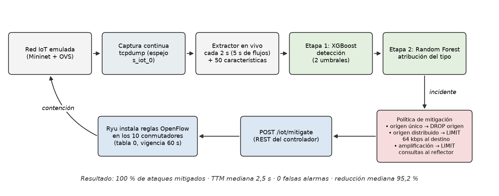
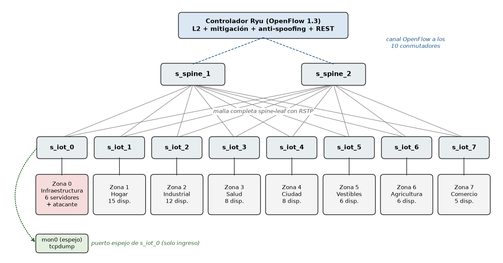
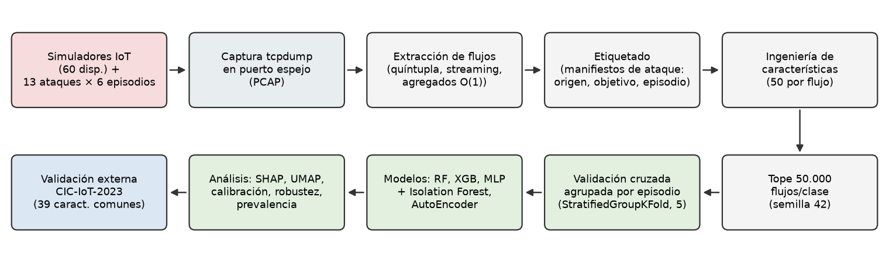

# IoT-SDN-AI: detección y mitigación automática de ataques IoT con aprendizaje automático sobre SDN

Laboratorio reproducible que **emula una red IoT de 67 hosts sobre SDN, genera tráfico benigno y 14 escenarios de ataque, entrena modelos de detección y los conecta al controlador para mitigar ataques en lazo cerrado, sin intervención humana**.

Proyecto de trabajo de grado — Ingeniería de Sistemas, Universidad Cooperativa de Colombia (2026).
Autor: Milton Alberto Quintero Estrada · Asesor: Ph.D. Néstor Alzate Mejía.

<p align="center">
  
</p>

## Resultados principales

| Métrica | Valor | Protocolo |
|---|---|---|
| F1-macro multiclase (Random Forest, 14 clases) | **0,986 ± 0,014** | CV agrupada por episodio, 5 particiones (sin fuga de datos) |
| F1 detección ataque/benigno | **0,995** (AUC 0,999) | Laboratorio |
| Generalización a CIC-IoT-2023 | **F1 0,940** · AUC 0,948 | 39 características comunes |
| Detector a prevalencia realista (1 % ataques, XGBoost) | recall **0,996** con precisión ≥ 0,9 | Re-ponderación del benigno |
| Lazo cerrado: ataques detectados y mitigados | **65/65** · 0 falsas alarmas · 0 reglas colaterales | 5 corridas × (120 s benigno + 13 ataques reales) |
| Tiempo hasta la mitigación | mediana **5,3 s** (por corrida 5,1 ± 0,9 s) | Inicio del ataque → regla OpenFlow instalada |
| Reducción del tráfico de ataque | mediana **94,6 %** | Medida en la víctima / reflector |
| Latencia de inferencia | ~0,7 ms por lote | — |

Detalle, limitaciones y todas las cifras: [`docs/resultados/RESULTADOS-FINAL.md`](docs/resultados/RESULTADOS-FINAL.md).

## Arquitectura

<p align="center">
  
</p>

- **Red:** Mininet + Open vSwitch, topología spine-leaf de 10 conmutadores OpenFlow 1.3 con RSTP; 60 dispositivos IoT simulados en 7 zonas (MQTT, CoAP, HTTP, DNS, NTP, SSDP, Modbus) y 6 servidores.
- **Control:** Ryu con tres aplicaciones — conmutación L2, mitigación (DROP / LIMIT con medidores OpenFlow, API REST) y anti-spoofing IP-MAC.
- **Ataques:** 14 escenarios en 8 familias (floods, slowloris, escaneo, amplificación DNS/CoAP/SSDP, abuso de MQTT, fuerza bruta, botnet Mirai, ARP spoofing), ejecutados en episodios con orígenes rotados.
- **Datos:** captura por puerto espejo → extractor de flujos en streaming → etiquetado por manifiestos → 50 características por flujo.
- **Modelos:** Random Forest, XGBoost, MLP, Isolation Forest y AutoEncoder; arquitectura de dos etapas en vivo (XGBoost detecta, Random Forest atribuye el tipo).

<p align="center">
  
</p>

## Estructura del repositorio

```
.
├── iot/                    # Laboratorio IoT
│   ├── zones.yaml          #   catálogo de zonas y dispositivos
│   ├── topology/           #   generador e importador de topologías, lanzador Mininet
│   ├── devices/            #   simuladores de dispositivos y servidores
│   ├── attacks/            #   catálogo y escenarios de ataque
│   ├── controller/         #   apps Ryu: L2, mitigación, anti-spoofing
│   └── pipeline/           #   espejo, extracción de flujos, etiquetado, características
├── ml_extra/               # Entrenamiento, evaluación y lazo cerrado
│   ├── models/             #   definiciones de los 5 modelos
│   ├── artifacts/          #   métricas (JSON), figuras y reportes generados
│   ├── eval_grouped_cv.py  #   validación cruzada agrupada (anti-fuga)
│   ├── live_detector.py    #   detector en vivo de dos etapas
│   └── closed_loop_eval.py #   experimento de lazo cerrado
├── dashboard/              # Panel web (FastAPI) + Grafana/Prometheus
├── scripts/                # Orquestación, benchmarks y pruebas de mitigación
│   └── debug/              #   utilidades de diagnóstico del laboratorio
├── tests/                  # Pruebas unitarias (pytest)
├── docs/                   # Documentación (ver docs/README.md)
├── SdnShare/               # Laboratorio SDN base (terceros)
├── Makefile, Makefile.iot  # Todos los comandos: `make help`
└── docker-compose.override.yaml
```

## Inicio rápido

Requisitos: VM Linux (Ubuntu 22.04 probado, ≥ 4 GB RAM, ~30 GB de disco) con Docker y Docker Compose.

```bash
make help                               # lista de comandos
make iot-up                             # controlador + contenedor Mininet
make iot-topo                           # topología IoT con tráfico benigno automático
make iot-attack SCN=syn_flood           # lanzar un escenario
bash scripts/rerun_pipeline.sh          # corrida completa: ataques + captura + dataset
make iot-train RUN=<run_id>             # entrenar los 5 modelos
make iot-closed-loop                    # experimento de lazo cerrado (13 ataques)
bash scripts/closed_loop_reps.sh 5      # 5 corridas + agregación (ml_extra/closed_loop_aggregate.py)
make iot-test                           # pruebas unitarias
```

Guía completa del laboratorio: [`docs/guias/laboratorio.md`](docs/guias/laboratorio.md).

## Reproducibilidad

- El análisis de ML debe correr con las versiones exactas de [`requirements-ml.txt`](requirements-ml.txt) (scikit-learn 1.7.2, XGBoost 3.2.0): otras versiones cambian la partición agrupada y los modelos serializados dejan de ser compatibles.
- Semillas fijas (42) en particiones, muestreo y modelos.
- Los datos (PCAP, flujos y dataset, ~9 GB) y los modelos `.joblib` no se versionan: se regeneran con `scripts/rerun_pipeline.sh` y `make iot-train`. Las métricas y figuras resultantes sí están en `ml_extra/artifacts/`.
- Validación externa: [`docs/guias/GUIA-CIC-descarga.md`](docs/guias/GUIA-CIC-descarga.md).

## Documentación

| Documento | Contenido |
|---|---|
| [`docs/pasos/`](docs/pasos) | Construcción del laboratorio paso a paso (15 guías) |
| [`docs/resultados/`](docs/resultados) | Resultados finales, plan de mejoras y evidencia de mitigación |
| [`docs/tesis/`](docs/tesis) | Diagramas del sistema (`figuras/diagramas.py`) y runbook de re-ejecución |

El documento del trabajo de grado se publicará tras su sustentación.

## Citar

Ver [`CITATION.cff`](CITATION.cff).

## Licencia y créditos

Código propio bajo licencia [MIT](LICENSE). El directorio `SdnShare/` es el laboratorio base de [SdnShare](https://github.com/JosephRodriri/SdnShare) y conserva los términos de su autor.
